# Documentación del Proyecto Final - Tienda Virtual "TechZone CR"

**Curso:** Tecnologías y Sistemas Web II (ITI-523)  
**Proyecto:** Tienda Virtual Completa de Productos Tecnológicos  
**Integrantes:**
- Dylan Sanabria
- Dylan Cerda
- Cristian Rojas

---

## 1. Descripción del Proyecto

**TechZone CR** es una tienda virtual completa e intuitiva diseñada para la comercialización de productos tecnológicos (laptops, smartphones, audio y accesorios) en Costa Rica. El sistema fue desarrollado utilizando **PHP con el framework Laravel**, base de datos **SQLite**, y un frontend dinámico y responsivo construido con **HTML5, CSS3, Bootstrap 5 y JavaScript**.

El proyecto cumple a cabalidad con todos los requerimientos funcionales y de seguridad solicitados por la docente, garantizando una experiencia de usuario fluida, cálculos precisos de impuestos y envíos, seguimiento de paquetes, historial de compras, cookies de productos vistos recientemente y exportación de reportes de ventas a formato PDF.

---

## 2. Funcionalidades Principales Desarrolladas

1. **Autenticación y Gestión de Usuarios:**
   - Registro de usuarios nuevos con comprobación de correo único y contraseñas seguras.
   - Inicio y cierre de sesión con tokens CSRF y protección de sesión.
   - Perfil de usuario con opción para modificar datos personales (nombre, teléfono, dirección, contraseña) y visualizar el historial completo de pedidos.

2. **Catálogo de Productos y Búsqueda Avanzada:**
   - Categorización de productos (Laptops & Computadoras, Smartphones & Celulares, Audio & Auriculares, Accesorios & Periféricos).
   - Fichas técnicas detalladas con especificaciones (RAM, SSD, CPU), stock en tiempo real e imágenes representativas.
   - Búsqueda por palabra clave y filtrado dinámico por categoría, rango de precios (mínimo y máximo) y ordenamiento por precio o nombre.

3. **Productos Vistos Recientemente (Sistema de Cookies):**
   - Utilización de cookies HTTP (`recently_viewed`) para rastrear y desplegar automáticamente en la tienda los últimos 6 productos que el usuario ha visitado.

4. **Carrito de Compras:**
   - Agregar, actualizar cantidades y eliminar productos.
   - Cálculo automático del Subtotal, Impuesto de Ventas del **13% IVA**, y costo de envío (Envío **Gratis** en compras superiores a ₡50.000 o tarifa plana de ₡3.500 en compras menores).

5. **Proceso de Pago e Facturación (Checkout):**
   - Pasarela de pago integrada que permite seleccionar entre **Tarjeta de Crédito/Débito** (con validación de número de 16 dígitos, titular, vencimiento y CVV), **PayPal** o **SINPE Móvil**.
   - Generación de factura electrónica con ID de usuario, fecha de compra, método de pago, desglose de ítems, IVA y total.
   - Asignación de un **Número de Seguimiento Único** (`TRK-XXXXX`) para cada orden procesada.
   - Pantalla de confirmación con vista previa e impresión de comprobante.

6. **Reportes de Ventas en PDF:**
   - Módulo administrativo restringido a usuarios con rol `admin`.
   - Generación y descarga de **Reporte de Ventas por Mes** en PDF.
   - Generación y descarga de **Reporte de Ventas por Cliente** en PDF.

7. **Pruebas Unitarias (PHPUnit):**
   - Suite de pruebas automatizadas que valida la carga del sistema, registro de usuarios, filtrado de catálogo, cálculo del carrito de compras (subtotal, IVA 13%, envío) y flujo de checkout con generación de número de seguimiento.

---

## 3. Diagrama de Caso de Uso (Proceso de Compra)

A continuación se presenta el diagrama de caso de uso en formato Mermaid que modela la interacción del Cliente y el Administrador durante el flujo de compra y facturación:

```mermaid
graph TD
    subgraph Cliente ["Actor: Cliente Registrado / Visitante"]
        A[Navegar por el Catálogo] --> B[Filtrar por Categoría / Precio]
        A --> C[Ver Detalle del Producto]
        C --> D[Guardar en Cookie Vistos Recientemente]
        C --> E[Agregar al Carrito de Compras]
        E --> F[Ver Carrito y Desglose IVA 13% + Envío]
        F --> G[Iniciar Sesión / Registrarse]
        G --> H[Proceder al Checkout]
        H --> I[Ingresar Dirección y Seleccionar Pago: Tarjeta / PayPal]
        I --> J[Procesar Pago Cifrado]
        J --> K[Generar Factura y Número de Tracking TRK-XXXXX]
        K --> L[Ver Historial en Perfil de Usuario]
    end

    subgraph Administrador ["Actor: Administrador del Sistema"]
        M[Iniciar Sesión Admin] --> N[Acceder al Módulo de Reportes]
        N --> O[Exportar PDF: Ventas por Mes]
        N --> P[Exportar PDF: Ventas por Cliente]
    end
```



---

## 4. Estructura de la Base de Datos (SQLite)

El proyecto utiliza una base de datos relacional SQLite (`database/database.sqlite`) con las siguientes tablas:

- `users`: Almacena información de los usuarios (id, name, email, password, phone, address, role).
- `categories`: Almacena las categorías de productos (id, name, slug, description, icon).
- `products`: Almacena el inventario (id, category_id, name, slug, description, price, stock, image, specs, is_featured).
- `orders`: Almacena las facturas generadas (id, user_id, tracking_number, subtotal, tax_amount, shipping_amount, total_amount, payment_method, shipping_address, contact_phone, status).
- `order_items`: Almacena el desglose de productos comprados (id, order_id, product_id, product_name, price, quantity, subtotal).

---

## 5. Instrucciones de Uso y Despliegue Local

### Requisitos del Sistema:
- PHP 8.2 o superior (con extensión `pdo_sqlite` habilitada).
- Composer 2.0+.
- Servidor local como Apache (XAMPP/WAMP) o la CLI de Laravel (`php artisan serve`).

### Pasos para Ejecutar Localmente:
1. Extraer la carpeta comprimida del proyecto en `c:\xampp\htdocs\` o directorio preferido.
2. Abrir una terminal en la raíz del proyecto.
3. Asegurar que las dependencias estén instaladas:
   ```bash
   composer install
   ```
4. Generar la clave de la aplicación Laravel:
   ```bash
   php artisan key:generate
   ```
5. Ejecutar las migraciones y sembrar la base de datos con usuarios y productos iniciales:
   ```bash
   php artisan migrate:fresh --seed
   ```
6. Iniciar el servidor local de desarrollo:
   ```bash
   php artisan serve
   ```
7. Acceder a la tienda en el navegador: `http://127.0.0.1:8000`

---

## 6. Cuentas de Demostración para Evaluación

Para facilitar la revisión por parte de la docente, el sistema incluye usuarios predefinidos:

- **Cuenta Administrador (Acceso a Reportes PDF):**
  - **Correo:** `admin@techzone.cr`
  - **Contraseña:** `admin123`

- **Cuenta Cliente (Realizar compras de prueba):**
  - **Correo:** `estudiante@tienda.com`
  - **Contraseña:** `12345678`

---

## 7. Instrucciones para Hosting, Certificado SSL y GitHub

### Publicación en GitHub:
1. Crear un repositorio en GitHub (ej: `tienda-virtual-techzone`).
2. Vincular el repositorio local y subir el código:
   ```bash
   git init
   git add .
   git commit -m "Proyecto Final Tienda Virtual TechZone CR - Entregable Completo"
   git branch -M main
   git remote add origin https://github.com/usuario/tienda-virtual-techzone.git
   git push -u origin main
   ```

### Despliegue en Hosting Gratuito y Certificado SSL:
- **Plataformas sugeridas:** Railway.app, Render.com o InfinityFree.
- **Certificado SSL (HTTPS):** 
  - Si se utiliza Railway o Render, el certificado SSL gratuito (HTTPS) se emite y renueva automáticamente a través de Let's Encrypt.
  - Si se utiliza un hosting tradicional con Apache, se puede habilitar el certificado SSL gratuito mediante Cloudflare (Flexible/Full SSL) activando la opción "Always Use HTTPS".

---

## 8. Ejecución de Pruebas Unitarias (PHPUnit)

Para verificar el correcto funcionamiento automatizado de todos los módulos principales del sistema, ejecutar el siguiente comando en la terminal:

```bash
php artisan test
```

Todas las pruebas deben pasar con estado **OK**.
